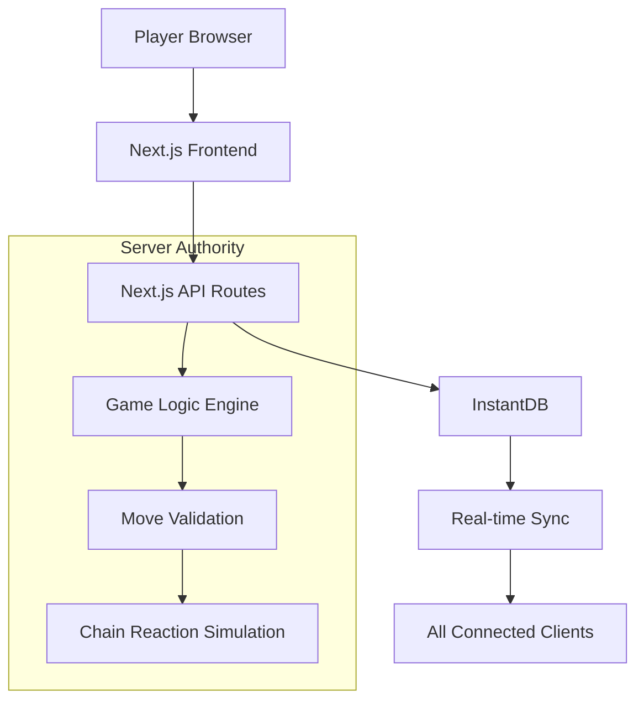
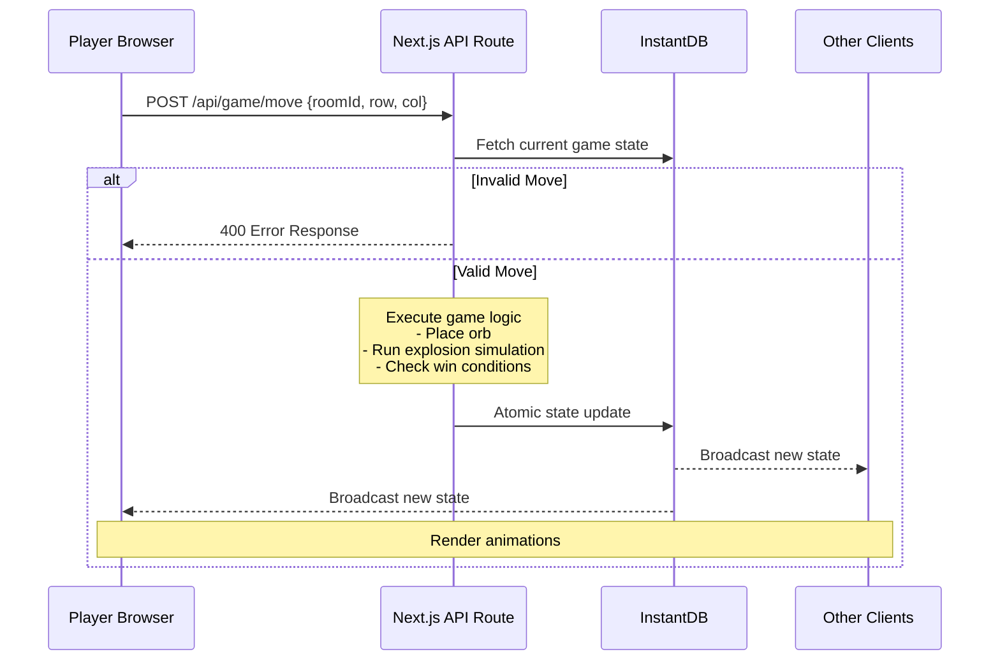

# Design Document

## Overview

The Live Chain Reaction game is built using a server-authoritative architecture with Next.js for the frontend and API routes, and InstantDB for real-time state storage and synchronization. The system ensures game integrity by processing all game logic on the server while providing real-time updates to all connected clients.

## Architecture

### High-Level Architecture

The system follows a server-authoritative model where:
- **Client**: Renders UI, captures user input, displays animations
- **Server**: Validates moves, executes game logic, maintains authoritative state
- **Database**: Stores persistent game state, handles real-time synchronization



### Move Processing Flow



## Components and Interfaces

### Frontend Components

#### Core Components
- **GameProvider**: React context for game state management
- **GameBoard**: Main game grid component with cell interactions
- **PlayerList**: Displays current players, their colors, and orb counts
- **GameControls**: Turn indicators, timers, and action buttons
- **ChatPanel**: Real-time messaging interface
- **SpectatorView**: Read-only game view for non-players

#### UI Component Hierarchy
```
App
├── HomePage (lobby/join interface)
├── GameRoom
│   ├── GameProvider (context)
│   ├── GameBoard
│   │   └── Cell (individual grid cells)
│   ├── PlayerList
│   ├── GameControls
│   │   ├── TurnIndicator
│   │   ├── GameTimer
│   │   └── ActionButtons (undo, etc.)
│   ├── ChatPanel
│   └── SpectatorControls
```

### Backend API Endpoints

#### Room Management
- `POST /api/room/create` - Create new game room
- `POST /api/room/join` - Join existing room
- `GET /api/room/[id]` - Get room details

#### Game Actions
- `POST /api/game/move` - Submit player move
- `POST /api/game/undo` - Undo last move (if enabled)
- `POST /api/game/start` - Start game from lobby
- `POST /api/game/reset` - Reset game state

#### User Management
- `POST /api/user/create` - Create temporary user session
- `GET /api/user/stats` - Get player statistics

## Data Models

### InstantDB Schema

```typescript
// Core game state structure
interface GameState {
  grid: Cell[][];           // 2D array of game cells
  players: Player[];        // Array of active players
  currentPlayerId: string;  // ID of current turn player
  moveCount: number;        // Total moves made
  turnStartedAt: number;    // Timestamp of turn start
  status: 'lobby' | 'active' | 'finished' | 'runaway';
  winner?: string;          // Winner ID if game finished
}

interface Cell {
  orbs: number;            // Number of orbs in cell
  ownerId?: string;        // Player who owns the cell
  criticalMass: number;    // Explosion threshold (2-4)
}

interface Player {
  id: string;
  name: string;
  color: string;
  orbCount: number;
  isEliminated: boolean;
  isConnected: boolean;
}

// Room configuration
interface RoomSettings {
  maxPlayers: number;      // 2-8 players
  boardSize: {rows: number, cols: number};
  gameTimeLimit?: number;  // Overall game time limit
  moveTimeLimit?: number;  // Per-move time limit
  undoEnabled: boolean;
  isPrivate: boolean;
}
```

### Database Schema (InstantDB)

```typescript
const schema = i.schema({
  users: i.entity({
    name: i.string().unique(),
    wins: i.number().default(0),
    gamesPlayed: i.number().default(0),
    createdAt: i.number(),
  }),
  
  rooms: i.entity({
    name: i.string(),
    status: i.string().default("lobby"),
    hostId: i.string(),
    gameState: i.object({
      grid: i.any(),
      players: i.any(),
      currentPlayerId: i.string(),
      moveCount: i.number(),
      turnStartedAt: i.number(),
      status: i.string(),
      winner: i.string().optional(),
    }),
    settings: i.object({
      maxPlayers: i.number(),
      boardSize: i.object({
        rows: i.number(),
        cols: i.number(),
      }),
      gameTimeLimit: i.number().optional(),
      moveTimeLimit: i.number().optional(),
      undoEnabled: i.boolean(),
      isPrivate: i.boolean(),
    }),
    history: i.array(i.any()).default([]),
    createdAt: i.number(),
  }),
  
  chatMessages: i.entity({
    roomId: i.string(),
    userId: i.string(),
    text: i.string(),
    createdAt: i.number(),
  }),
  
  links: {
    roomMessages: {
      forward: { on: "rooms", has: "many", label: "messages" },
      reverse: { on: "chatMessages", has: "one", label: "room" }
    }
  },
  
  ephemeral: {
    rooms: {
      presence: i.entity({
        name: i.string(),
        role: i.string(), // 'player' | 'spectator'
        userId: i.string(),
      }),
      topics: {
        reactions: i.entity({
          emoji: i.string(),
          senderId: i.string(),
          timestamp: i.number(),
        }),
      },
    },
  },
});
```

## Error Handling

### Game Logic Error Handling

#### Runaway Chain Reactions
- **Detection**: Count explosion waves during simulation
- **Threshold**: If waves exceed `rows * cols`, declare runaway
- **Response**: Set game status to "runaway", declare current player winner
- **Prevention**: Implement maximum simulation depth limit

#### Invalid Move Handling
- **Validation**: Check turn order, cell ownership, game status
- **Response**: Return 400 error with specific error message
- **Client Handling**: Display error message, maintain current state

#### Connection Issues
- **Detection**: Use InstantDB presence to track connections
- **Timeout Handling**: Skip turns for disconnected players after timeout
- **Reconnection**: Allow seamless rejoin with session restoration

### Frontend Error Boundaries

```typescript
// Error boundary for game components
class GameErrorBoundary extends React.Component {
  // Handle rendering errors gracefully
  // Provide fallback UI and error reporting
}

// Network error handling
const handleNetworkError = (error: Error) => {
  // Retry logic for transient failures
  // User notification for persistent issues
  // Graceful degradation when possible
};
```

## Testing Strategy

### Unit Testing
- **Game Logic**: Test all chain reaction scenarios, edge cases
- **Move Validation**: Test all invalid move conditions
- **Win Conditions**: Test elimination and victory scenarios
- **Utility Functions**: Test grid operations, player management

### Integration Testing
- **API Endpoints**: Test complete request/response cycles
- **Database Operations**: Test atomic transactions, state consistency
- **Real-time Sync**: Test multi-client state synchronization

### End-to-End Testing
- **Complete Game Flow**: Test full game from creation to completion
- **Multi-player Scenarios**: Test concurrent player interactions
- **Error Recovery**: Test disconnection and reconnection scenarios

### Performance Testing
- **Chain Reaction Simulation**: Test with maximum complexity scenarios
- **Concurrent Users**: Test multiple simultaneous games
- **Database Load**: Test with high-frequency state updates

### Test Data and Scenarios

```typescript
// Test scenarios for chain reactions
const testScenarios = [
  {
    name: "Simple explosion",
    grid: [[{orbs: 2, ownerId: "p1"}]], // Corner cell at critical mass
    expected: "Single explosion with orb distribution"
  },
  {
    name: "Chain reaction",
    grid: /* Complex grid setup */,
    expected: "Multi-wave explosion sequence"
  },
  {
    name: "Runaway detection",
    grid: /* Pathological case */,
    expected: "Runaway detection and game termination"
  }
];
```

## Security Considerations

### Server Authority
- All game state mutations occur server-side
- Client requests are treated as intents, not commands
- Database rules prevent direct client writes to protected fields

### Input Validation
- Validate all move coordinates and player IDs
- Sanitize chat messages and user names
- Rate limiting on API endpoints

### Session Management
- Temporary sessions for anonymous play
- Secure session tokens for persistent accounts
- Session timeout and cleanup

This design provides a robust foundation for the Live Chain Reaction game with proper separation of concerns, real-time capabilities, and comprehensive error handling.