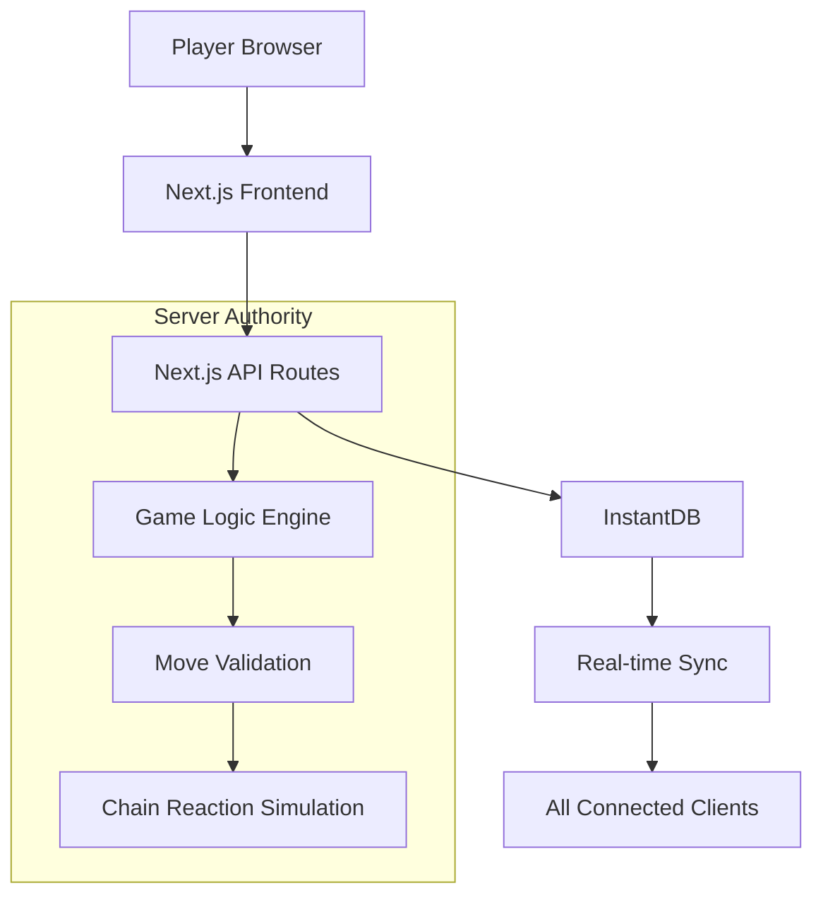
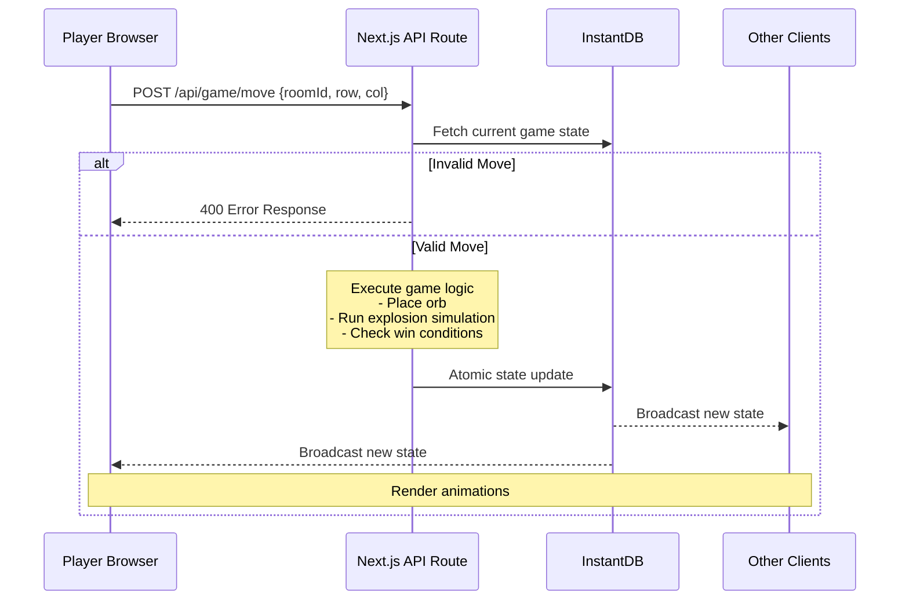

# Design Document

## Overview

The Live Chain Reaction game is built using a server-authoritative architecture with Next.js for the frontend and API routes, and InstantDB for real-time state storage and synchronization. The system ensures game integrity by processing all game logic on the server while providing real-time updates to all connected clients.

**Implementation Status**: The architecture has been successfully implemented with clear separation between client-side rendering (using `db` from `@instantdb/react`) and server-side authority (using `adminDb` from `@instantdb/admin`). All core architectural components are functional and tested. Recent major enhancements include a unified UI system, professional animation framework, and complete emoji reactions implementation.

## Architecture

### High-Level Architecture

The system follows a server-authoritative model where:
- **Client**: Renders UI, captures user input, displays animations
- **Server**: Validates moves, executes game logic, maintains authoritative state
- **Database**: Stores persistent game state, handles real-time synchronization



### Move Processing Flow



## Components and Interfaces

### Frontend Components

#### Core Components (All Implemented)
- **GameProvider**: React context for game state management (`/src/contexts/GameContext.tsx`)
- **GameBoard**: Main game grid component with cell interactions and unified sizing algorithm (`/src/components/GameBoard.tsx`)
- **PlayerList**: Displays current players, their colors, and orb counts (`/src/components/PlayerList.tsx`)
- **GameControls**: Turn indicators, timers, and action buttons (`/src/components/GameControls.tsx`)
- **ChatModal**: Modal-based chat for players in GameRoom (`/src/components/ChatModalFixed.tsx`)
- **ChatPanel**: Embedded chat panel for spectators (`/src/components/ChatPanel.tsx`)
- **SpectatorView**: Read-only game view for non-players (`/src/components/SpectatorView.tsx`)
- **ReactionPicker**: Emoji selection component with 20 predefined reactions (`/src/components/ReactionPicker.tsx`)
- **ReactionOverlay**: Animated reaction display with real-time sync (`/src/components/ReactionOverlay.tsx`)

#### New UI System Components (Recently Added)
- **MinimalTopBar**: Streamlined header with dynamic content and room ID copy (`/src/components/MinimalTopBar.tsx`)
- **FloatingActionBar**: Unified action button system with mobile FAB and desktop horizontal bar (`/src/components/FloatingActionBar.tsx`)
- **ModalBase**: Reusable modal foundation for all overlays (`/src/components/ModalBase.tsx`)
- **PlayersModal**: Player list in modal format (`/src/components/PlayersModal.tsx`)
- **LobbyModal**: Pre-game lobby in modal format (`/src/components/LobbyModal.tsx`)

#### Animation System Components (Enhanced)
- **AnimatedCell**: Individual cell with smooth orb transitions and explosion effects (`/src/components/AnimatedCell.tsx`)
- **AnimationLayer**: Flying orbs and chain reaction visual effects (`/src/components/AnimationLayer.tsx`)
- **VictoryMessage**: Enhanced victory experience with differentiated messages (`/src/components/VictoryMessage.tsx`)

#### UI Component Hierarchy
```
App
├── HomePage (lobby/join interface)
├── GameRoom (for players)
│   ├── GameProvider (context)
│   ├── GameBoard
│   │   └── Cell (individual grid cells)
│   ├── FloatingActionBar (mobile-friendly buttons)
│   ├── Modals (all use ModalBase)
│   │   ├── ChatModal (chat in modal overlay)
│   │   ├── PlayersModal
│   │   ├── LobbyModal
│   │   └── Settings/Stats/Help modals
│   └── MinimalTopBar
└── SpectatorView (for spectators)
    ├── GameBoard (read-only)
    ├── PlayerList
    ├── ChatPanel (embedded sidebar)
    └── GameTimers
```

### Backend API Endpoints

#### Room Management (Implemented)
- `POST /api/room/create` - Create new game room ✅
- `POST /api/room/join` - Join existing room ✅
- `GET /api/room/[id]` - Get room details ✅

#### Game Actions (Implemented)
- `POST /api/game/move` - Submit player move ✅
- `POST /api/game/undo` - Undo last move (if enabled) ✅
- `POST /api/game/start` - Start game from lobby ✅
- `POST /api/game/timeout` - Handle game/move timeouts ✅
- `POST /api/game/restart` - Restart game with same players (host only) ✅

#### Chat System (Implemented)
- `POST /api/chat/send` - Send chat message ✅

#### User Management (Partially Implemented)
- `POST /api/user/create` - Create temporary user session ✅
- `GET /api/user/stats` - Get player statistics ❌ (Not implemented)

## Data Models

### InstantDB Schema

```typescript
// Core game state structure
interface GameState {
  grid: Cell[][];           // 2D array of game cells
  players: Player[];        // Array of active players
  currentPlayerId: string;  // ID of current turn player
  moveCount: number;        // Total moves made
  turnStartedAt: number;    // Timestamp of turn start
  status: 'lobby' | 'active' | 'finished' | 'runaway';
  winner?: string;          // Winner ID if game finished
}

interface Cell {
  orbs: number;            // Number of orbs in cell
  ownerId?: string;        // Player who owns the cell
  criticalMass: number;    // Explosion threshold (2-4)
}

interface Player {
  id: string;
  name: string;
  color: string;
  orbCount: number;
  isEliminated: boolean;
  isConnected: boolean;
}

// Room configuration
interface RoomSettings {
  maxPlayers: number;      // 2-8 players
  boardSize: {rows: number, cols: number};
  gameTimeLimit?: number;  // Overall game time limit
  moveTimeLimit?: number;  // Per-move time limit
  undoEnabled: boolean;
  isPrivate: boolean;
}
```

### Database Schema (InstantDB)

```typescript
const schema = i.schema({
  users: i.entity({
    name: i.string().unique(),
    wins: i.number().default(0),
    gamesPlayed: i.number().default(0),
    createdAt: i.number(),
  }),
  
  rooms: i.entity({
    name: i.string(),
    status: i.string().default("lobby"),
    hostId: i.string(),
    gameState: i.object({
      grid: i.any(),
      players: i.any(),
      currentPlayerId: i.string(),
      moveCount: i.number(),
      turnStartedAt: i.number(),
      status: i.string(),
      winner: i.string().optional(),
    }),
    settings: i.object({
      maxPlayers: i.number(),
      boardSize: i.object({
        rows: i.number(),
        cols: i.number(),
      }),
      gameTimeLimit: i.number().optional(),
      moveTimeLimit: i.number().optional(),
      undoEnabled: i.boolean(),
      isPrivate: i.boolean(),
    }),
    history: i.array(i.any()).default([]),
    createdAt: i.number(),
  }),
  
  chatMessages: i.entity({
    roomId: i.string(),
    userId: i.string(),
    text: i.string(),
    createdAt: i.number(),
  }),
  
  links: {
    roomMessages: {
      forward: { on: "rooms", has: "many", label: "messages" },
      reverse: { on: "chatMessages", has: "one", label: "room" }
    }
  },
  
  ephemeral: {
    rooms: {
      presence: i.entity({
        name: i.string(),
        role: i.string(), // 'player' | 'spectator'
        userId: i.string(),
      }),
      topics: {
        reactions: i.entity({
          emoji: i.string(),
          senderId: i.string(),
          timestamp: i.number(),
        }),
      },
    },
  },
});
```

## Error Handling

### Game Logic Error Handling

#### Runaway Chain Reactions
- **Detection**: Count explosion waves during simulation
- **Threshold**: If waves exceed `rows * cols`, declare runaway
- **Response**: Set game status to "runaway", declare current player winner
- **Prevention**: Implement maximum simulation depth limit

#### Invalid Move Handling
- **Validation**: Check turn order, cell ownership, game status
- **Response**: Return 400 error with specific error message
- **Client Handling**: Display error message, maintain current state

#### Connection Issues
- **Detection**: Use InstantDB presence to track connections
- **Timeout Handling**: Skip turns for disconnected players after timeout
- **Reconnection**: Allow seamless rejoin with session restoration

### Frontend Error Handling

**Current Implementation**:
- Network error handling in API calls with user-friendly messages
- Graceful disconnection handling via InstantDB presence
- Error states in components with fallback UI
- Session restoration on reconnection

**Pending Implementation**:
- React Error Boundaries for component crash recovery
- Global error reporting system
- Automatic retry mechanisms for transient failures

```typescript
// Example of current error handling pattern
try {
  const response = await fetch('/api/game/move', {...});
  if (!response.ok) throw new Error('Move failed');
} catch (error) {
  console.error('Error:', error);
  // Show user-friendly message
  alert('Failed to make move. Please try again.');
}
```

## Testing Strategy

### Unit Testing
- **Game Logic**: Test all chain reaction scenarios, edge cases
- **Move Validation**: Test all invalid move conditions
- **Win Conditions**: Test elimination and victory scenarios
- **Utility Functions**: Test grid operations, player management

### Integration Testing
- **API Endpoints**: Test complete request/response cycles
- **Database Operations**: Test atomic transactions, state consistency
- **Real-time Sync**: Test multi-client state synchronization

### End-to-End Testing
- **Complete Game Flow**: Test full game from creation to completion
- **Multi-player Scenarios**: Test concurrent player interactions
- **Error Recovery**: Test disconnection and reconnection scenarios

### Performance Testing
- **Chain Reaction Simulation**: Test with maximum complexity scenarios
- **Concurrent Users**: Test multiple simultaneous games
- **Database Load**: Test with high-frequency state updates

### Test Data and Scenarios

```typescript
// Test scenarios for chain reactions
const testScenarios = [
  {
    name: "Simple explosion",
    grid: [[{orbs: 2, ownerId: "p1"}]], // Corner cell at critical mass
    expected: "Single explosion with orb distribution"
  },
  {
    name: "Chain reaction",
    grid: /* Complex grid setup */,
    expected: "Multi-wave explosion sequence"
  },
  {
    name: "Runaway detection",
    grid: /* Pathological case */,
    expected: "Runaway detection and game termination"
  }
];
```

## Current Implementation Structure

### Project File Organization
```
/projects/rxn_mcp/
├── src/
│   ├── app/                        # Next.js app directory
│   │   ├── api/                   # Server-side API routes
│   │   │   ├── chat/              # Chat messaging endpoints
│   │   │   ├── game/              # Game action endpoints
│   │   │   │   ├── move/         # Move validation and processing
│   │   │   │   ├── start/        # Game initialization
│   │   │   │   ├── timeout/      # Timeout handling
│   │   │   │   ├── undo/         # Undo functionality
│   │   │   │   └── restart/      # Game restart functionality
│   │   │   ├── room/              # Room management
│   │   │   └── user/              # User session management
│   │   ├── room/[id]/            # Dynamic room pages
│   │   └── page.tsx               # Home page
│   ├── components/                # React components (30+ components)
│   │   ├── __tests__/            # Component unit tests (14 test files)
│   │   ├── GameRoom.tsx          # Main game interface with unified UI
│   │   ├── FloatingActionBar.tsx # Mobile FAB and desktop action bar
│   │   ├── MinimalTopBar.tsx     # Streamlined header with dynamic content
│   │   ├── ModalBase.tsx         # Reusable modal foundation
│   │   ├── AnimatedCell.tsx      # Enhanced cell with smooth animations
│   │   ├── AnimationLayer.tsx    # Flying orbs and chain reaction effects
│   │   ├── ReactionPicker.tsx    # Emoji selection with 20 reactions
│   │   ├── ReactionOverlay.tsx   # Animated reactions with real-time sync
│   │   └── [other components]    # Additional UI components
│   ├── contexts/                  # React contexts
│   │   └── GameContext.tsx       # Main game state provider
│   ├── lib/                       # Utilities and logic
│   │   ├── hooks/                # Custom React hooks
│   │   ├── instant.ts            # Client-side InstantDB
│   │   ├── admin.ts              # Server-side InstantDB
│   │   ├── gameLogic.ts          # Core game mechanics
│   │   ├── animationUtils.ts     # Animation calculations and utilities
│   │   └── [other utilities]     # Helper functions
│   └── types/                     # TypeScript definitions
├── instant.schema.ts              # Database schema
├── instant.perms.ts               # Access permissions
├── package.json                   # Dependencies (Next.js 15, React 19)
└── .kiro/specs/                   # Project specifications
```

### Key Implementation Decisions

1. **Database Client Separation**: Fixed the critical issue of using React client in server routes by creating separate imports:
   - Client components: `import { db } from '@/lib/instant'`
   - Server routes: `import { adminDb } from '@/lib/admin'`

2. **Unified UI Architecture**: Complete redesign for optimal user experience:
   - **Game-First Layout**: 70-80% of screen dedicated to game board
   - **Progressive Disclosure**: Information shown only when needed
   - **Mobile FAB System**: Expandable floating action button for mobile
   - **Desktop Action Bar**: Horizontal button bar at bottom center
   - **Modal-Based Panels**: All secondary UI in overlays to maximize game space

3. **Chat Implementation Strategy**: 
   - **Players (GameRoom)**: Use `ChatModal` - modal overlay that can be opened/closed to maximize game space
   - **Spectators (SpectatorView)**: Use `ChatPanel` - permanent sidebar since they have more screen space
   - Both query ALL messages then filter client-side to avoid InstantDB query issues

4. **Animation System**: Professional-grade animations using react-spring:
   - **Individual Orb Transitions**: Each orb animates with spring physics
   - **Cell-Based Explosions**: Separate explosion effects from cell scaling
   - **Flying Orbs**: Visual representation of chain reaction spread
   - **Coordinate System Alignment**: Animation overlays share same coordinate system as game elements

5. **Component Architecture**: Using composition pattern with modals (via ModalBase) for better mobile UX

6. **State Management**: Leveraging InstantDB's real-time capabilities for state sync rather than Redux/Zustand

7. **Emoji Reactions**: Real-time sync using InstantDB ephemeral topics with proper ID generation and animation handling

8. **Testing Approach**: Unit tests for components and logic, integration tests for key flows

## Security Considerations

### Server Authority
- All game state mutations occur server-side
- Client requests are treated as intents, not commands
- Database rules prevent direct client writes to protected fields

### Input Validation
- Validate all move coordinates and player IDs
- Sanitize chat messages and user names
- Rate limiting on API endpoints

### Session Management
- Temporary sessions for anonymous play
- Secure session tokens for persistent accounts
- Session timeout and cleanup

This design provides a robust foundation for the Live Chain Reaction game with proper separation of concerns, real-time capabilities, and comprehensive error handling.