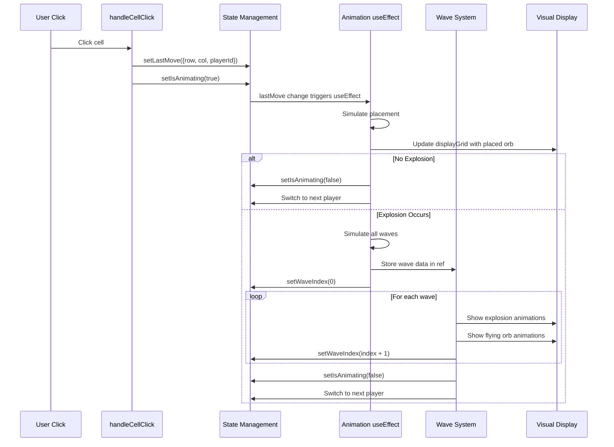

# MockBoard Enhancement Design Document

## Overview

The MockBoard enhancement will refactor the tutorial component to perfectly mirror the GameBoard's sophisticated wave-based animation system while upgrading from a 3x3 to a 5x5 grid. This will provide a consistent learning experience where tutorial animations match the actual game behavior, allowing for more complex chain reaction demonstrations.

The current MockBoard uses a simplified animation approach with direct `setTimeout` calls in the `handleCellClick` function, while GameBoard uses a state-driven architecture where moves trigger `useEffect` hooks that manage wave-by-wave animations. This architectural mismatch creates inconsistent visual experiences between tutorial and actual gameplay.

## Architecture

### Current vs. Target Architecture

```mermaid
graph TB
    subgraph "Current MockBoard (3x3)"
        A1[handleCellClick] --> B1[Direct setTimeout calls]
        B1 --> C1[Inline animation logic]
        C1 --> D1[Basic explosion simulation]
    end
    
    subgraph "Target MockBoard (5x5)"
        A2[handleCellClick] --> B2[Set lastMove state]
        B2 --> C2[useEffect watches lastMove]
        C2 --> D2[Wave-based animation system]
        D2 --> E2[Same as GameBoard logic]
    end
    
    subgraph "GameBoard (Reference)"
        A3[handleCellClick] --> B3[Set lastMove state]
        B3 --> C3[useEffect watches lastMove]
        C3 --> D3[Wave-based animation system]
        D3 --> E3[Professional animations]
    end
```



### State Management Architecture

The enhanced MockBoard will use the same state separation pattern as GameBoard:

```typescript
// Logical state (source of truth)
const [logicalGrid, setLogicalGrid] = useState<MockCell[][]>();
const [lastMove, setLastMove] = useState<{row: number, col: number, playerId: string} | null>(null);

// Display state (what user sees during animations)
const [displayGrid, setDisplayGrid] = useState<MockCell[][]>();
const [isAnimating, setIsAnimating] = useState(false);

// Animation control
const [waveIndex, setWaveIndex] = useState(-1);
const waveDataRef = useRef<WaveData | null>(null);
const lastProcessedMove = useRef<LastMove | null>(null);
```

### Animation Flow Sequence



## Components and Interfaces

### Enhanced MockBoard Component

#### Props Interface
```typescript
interface MockBoardProps {
  className?: string;
  interactive?: boolean;
  initialSetup?: 'empty' | 'slide1' | 'slide2' | 'slide3' | 'slide4' | 'slide5';
  currentPlayer?: string;
  players?: MockPlayer[];
  onMove?: (row: number, col: number) => void;
}
```

#### State Interface
```typescript
interface MockBoardState {
  // Grid states
  logicalGrid: MockCell[][];      // Source of truth
  displayGrid: MockCell[][];      // What user sees
  
  // Animation control
  lastMove: LastMove | null;      // Triggers animations
  isAnimating: boolean;           // Prevents interactions
  waveIndex: number;              // Current animation wave (-1 = inactive)
  
  // Animation data
  currentAnimations: {
    explosions: ExplosionAnimation[];
    orbs: OrbAnimation[];
  };
  explodingCells: Set<string>;
  
  // Player state
  currentPlayerId: string;
}

interface LastMove {
  row: number;
  col: number;
  playerId: string;
}

interface WaveData {
  waves: Array<{
    explodingCells: Array<{row: number, col: number}>;
    gridState: MockCell[][];
  }>;
  finalGrid: MockCell[][];
  playerColor: string;
}
```

### Grid Size Enhancement

#### Current 3x3 Grid
```
[0,0] [0,1] [0,2]
[1,0] [1,1] [1,2]  
[2,0] [2,1] [2,2]
```

#### Target 5x5 Grid
```
[0,0] [0,1] [0,2] [0,3] [0,4]
[1,0] [1,1] [1,2] [1,3] [1,4]
[2,0] [2,1] [2,2] [2,3] [2,4]
[3,0] [3,1] [3,2] [3,3] [3,4]
[4,0] [4,1] [4,2] [4,3] [4,4]
```

#### Critical Mass Distribution
- **Corner cells (4)**: 2 orbs max
- **Edge cells (12)**: 3 orbs max  
- **Center cells (9)**: 4 orbs max

This provides much richer scenarios for demonstrating chain reactions with multiple waves.

## Data Models

### MockCell Interface
```typescript
interface MockCell {
  orbs: number;
  ownerId?: string;
  criticalMass: number;
}
```

### MockPlayer Interface
```typescript
interface MockPlayer {
  id: string;
  name: string;
  color: string;
  isEliminated?: boolean;
}
```

### Animation Interfaces (Reused from GameBoard)
```typescript
interface ExplosionAnimation {
  id: string;
  row: number;
  col: number;
  color: string;
  delay: number;
  wave: number;
}

interface OrbAnimation {
  id: string;
  fromRow: number;
  fromCol: number;
  toRow: number;
  toCol: number;
  color: string;
  delay: number;
  wave: number;
}
```

## Tutorial Slide Redesign

### Slide 1: Basic Placement (Interactive)
**Goal**: Teach fundamental orb placement mechanics

**5x5 Setup**:
```typescript
case 'slide1':
  newGrid[2][2] = { orbs: 1, ownerId: 'player1', criticalMass: 4 }; // Center
  newGrid[1][1] = { orbs: 1, ownerId: 'player2', criticalMass: 4 }; // Off-center
  break;
```

**Learning Objective**: Players understand they can place orbs in empty cells or cells they own

### Slide 2: Critical Mass Demonstration (Interactive)
**Goal**: Teach explosion trigger concept

**5x5 Setup**:
```typescript
case 'slide2':
  newGrid[2][2] = { orbs: 3, ownerId: 'player1', criticalMass: 4 }; // Center, ready to explode
  break;
```

**Learning Objective**: Players see pulsing effect and trigger their first explosion

### Slide 3: Cell Capacity Education (Static)
**Goal**: Explain different critical mass values

**5x5 Setup**:
```typescript
case 'slide3':
  // Corner (Critical Mass: 2)
  newGrid[0][0] = { orbs: 1, ownerId: 'player1', criticalMass: 2 };
  // Edge (Critical Mass: 3)  
  newGrid[0][2] = { orbs: 2, ownerId: 'player1', criticalMass: 3 };
  // Center (Critical Mass: 4)
  newGrid[2][2] = { orbs: 3, ownerId: 'player1', criticalMass: 4 };
  break;
```

**Learning Objective**: Visual understanding of position-based capacity differences

### Slide 4: Cell Infection Mechanics (Interactive)
**Goal**: Demonstrate cell capture through explosions

**5x5 Setup**:
```typescript
case 'slide4':
  newGrid[2][2] = { orbs: 3, ownerId: 'player1', criticalMass: 4 }; // Blue center, ready
  newGrid[1][2] = { orbs: 1, ownerId: 'player2', criticalMass: 3 }; // Red target above
  break;
```

**Learning Objective**: Players see how explosions capture opponent cells

### Slide 5: Chain Reaction Mastery (Interactive)
**Goal**: Showcase complex multi-wave chain reactions

**5x5 Setup**:
```typescript
case 'slide5':
  // The trigger
  newGrid[2][2] = { orbs: 3, ownerId: 'player1', criticalMass: 4 };
  // Chain reaction targets (all at critical-1)
  newGrid[1][2] = { orbs: 2, ownerId: 'player2', criticalMass: 3 };
  newGrid[2][1] = { orbs: 2, ownerId: 'player2', criticalMass: 3 };
  newGrid[3][2] = { orbs: 2, ownerId: 'player2', criticalMass: 3 };
  newGrid[2][3] = { orbs: 2, ownerId: 'player2', criticalMass: 3 };
  break;
```

**Learning Objective**: Players experience the excitement of cascading explosions

## Implementation Strategy

### Phase 1: Core Architecture Refactor

1. **State Management Overhaul**
   - Replace single `grid` state with `logicalGrid` and `displayGrid`
   - Add `lastMove` state as animation trigger
   - Add `lastProcessedMove` ref to prevent duplicate processing

2. **Grid Size Migration**
   - Change dimensions from 3x3 to 5x5
   - Update all tutorial setups for new grid size
   - Adjust responsive sizing calculations

3. **Animation System Integration**
   - Copy wave-based animation logic from GameBoard
   - Implement `simulateExplosionsWithWaves` function
   - Add wave management `useEffect` hooks

### Phase 2: handleCellClick Simplification

**Current Complex Logic**:
```typescript
const handleCellClick = async (row: number, col: number) => {
  // Validation
  // setIsAnimating(true)
  // Placement with setTimeout
  // Explosion simulation with setTimeout
  // Wave processing with setTimeout
  // Player switching
}
```

**Target Simplified Logic**:
```typescript
const handleCellClick = (row: number, col: number) => {
  // Validation only
  if (!interactive || isAnimating) return;
  
  // Set animation trigger
  setIsAnimating(true);
  setLastMove({ row, col, playerId: currentPlayerId });
  
  // Callback
  if (onMove) onMove(row, col);
}
```

### Phase 3: Animation useEffect Implementation

**Main Animation Driver**:
```typescript
useEffect(() => {
  if (!lastMove || alreadyProcessed(lastMove)) return;
  
  // Mark as processed
  lastProcessedMove.current = lastMove;
  
  // Simulate placement
  const gridAfterPlacement = simulatePlacement(logicalGrid, lastMove);
  setDisplayGrid(gridAfterPlacement);
  
  // Check for explosions
  if (noExplosion(gridAfterPlacement, lastMove)) {
    // Simple placement
    setTimeout(() => {
      setLogicalGrid(gridAfterPlacement);
      switchPlayer();
      setIsAnimating(false);
    }, 200);
    return;
  }
  
  // Complex explosion sequence
  const { finalGrid, explosionWaves } = simulateExplosionsWithWaves(
    gridAfterPlacement, 
    lastMove.playerId
  );
  
  // Start wave machine
  setTimeout(() => {
    waveDataRef.current = { waves: explosionWaves, finalGrid, playerColor };
    setWaveIndex(0);
  }, 100);
  
}, [lastMove, logicalGrid, /* other deps */]);
```

**Wave Processing useEffect**:
```typescript
useEffect(() => {
  if (waveIndex < 0 || !waveDataRef.current) return;
  
  const { waves, finalGrid, playerColor } = waveDataRef.current;
  
  if (waveIndex >= waves.length) {
    // All waves complete
    setLogicalGrid(finalGrid);
    setDisplayGrid(finalGrid);
    setIsAnimating(false);
    switchPlayer();
    cleanup();
    return;
  }
  
  // Process current wave
  const wave = waves[waveIndex];
  setDisplayGrid(wave.gridState);
  
  // Generate animations
  const explosionAnims = createExplosionAnimations(wave, playerColor, waveIndex);
  const orbAnims = createOrbAnimations(wave, playerColor, waveIndex);
  
  setCurrentAnimations({ explosions: explosionAnims, orbs: orbAnims });
  setExplodingCells(createExplodingSet(wave));
  
}, [waveIndex]);
```

### Phase 4: Tutorial Content Enhancement

1. **Slide Text Updates**
   - Rewrite all slide descriptions for 5x5 context
   - Add interactive instructions
   - Emphasize learning objectives

2. **Setup Configurations**
   - Design each slide setup for maximum educational impact
   - Ensure progressive complexity
   - Test all interactive scenarios

3. **Visual Polish**
   - Ensure consistent styling with GameBoard
   - Optimize responsive behavior
   - Add loading states if needed

## Error Handling

### Animation State Management
- **Race Condition Prevention**: Use `lastProcessedMove` ref to prevent duplicate processing
- **Cleanup on Unmount**: Clear all refs and timers
- **State Consistency**: Always sync `logicalGrid` and `displayGrid` after animations

### User Interaction Handling
- **Click Prevention**: Disable interactions during `isAnimating`
- **Invalid Move Feedback**: Show visual feedback for invalid clicks
- **Responsive Behavior**: Handle rapid clicking gracefully

### Tutorial Slide Transitions
- **State Reset**: Clear all animation state when `initialSetup` changes
- **Memory Cleanup**: Clear refs and timers on slide changes
- **Consistent Initialization**: Ensure each slide starts with clean state

## Testing Strategy

### Unit Testing
- **State Management**: Test all state transitions
- **Animation Logic**: Test wave simulation accuracy
- **Grid Operations**: Test 5x5 grid operations
- **Tutorial Setups**: Verify each slide configuration

### Integration Testing
- **Animation Consistency**: Compare MockBoard vs GameBoard animations
- **Tutorial Flow**: Test complete tutorial progression
- **Responsive Behavior**: Test on different screen sizes
- **Performance**: Ensure smooth animations on all devices

### Visual Testing
- **Animation Accuracy**: Verify visual consistency with GameBoard
- **Tutorial Clarity**: Ensure educational effectiveness
- **Cross-browser**: Test animation performance across browsers
- **Mobile Experience**: Verify touch interactions work properly

## Performance Considerations

### Animation Optimization
- **Stable Animation IDs**: Use deterministic IDs instead of `Date.now()`
- **Memoization**: Memoize expensive calculations
- **RAF Usage**: Use `requestAnimationFrame` for smooth animations
- **Memory Management**: Clean up refs and timers properly

### Responsive Design
- **Dynamic Sizing**: Calculate cell sizes based on viewport
- **Touch Optimization**: Ensure touch targets are appropriately sized
- **Performance Scaling**: Adjust animation complexity for lower-end devices

This design provides a comprehensive roadmap for creating a MockBoard component that perfectly mirrors GameBoard's sophisticated animation system while providing an enhanced educational experience through the larger 5x5 grid and redesigned tutorial content.